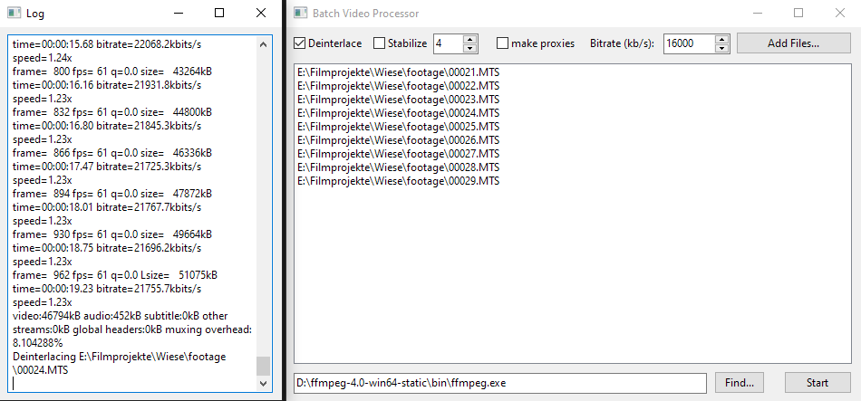

# BatchVideoProcessor
Fast and easy preprocessing using FFMPEG. If you don't get how it works, just RTFS (there is no manual, only source code). Or create an issue, maybe I'll add one then.

I wrote this tool for myself to make preprocessing easier for editing videos on a slow pc, so it might not fit your specific needs.
